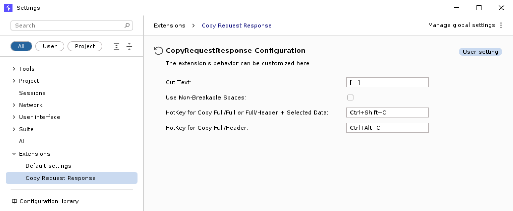

# Burp Extension: Copy Request & Response

## Description

Writing good reports is key in penetration tests / security assessments, since
this is the final result delivered to the customer. Vulnerabilities should be
described in a way so that the customer can understand and also reproduce the
issue. For web application pentests, the best way is often to show the HTTP
requests and responses to explain an issue. This Burp Suite extension "Copy
Request & Response" can assist you while the report.

When copying request/response from Burp, the workflow is often like this:

1. Select the request
2. Copy to clipboard
3. Switch to your reporting tool (Word, Markdown, Web App, LaTeX Editor, `$YOUNAMEIT`)
4. Paste the request
5. Switch back to Burp
6. Select the response (or only part of it if body is too big and you ony want to show the issue)
7. Copy to clipboard
8. Switch back to the report
9. Paste again
10. Add context to explain the request / response

The Copy Request & Response Burp Suite extension adds new context menu
entries as well as keyboard shortcuts that can be used to simply copy
the request and response from the selected message to the clipboard. 

The workflow can then look like this:

1. Press keyboard short cut or select what you want to copy from the context menu
2. Switch to the reporting tool
3. Paste
4. Add context to explain the request / response

Much easier, right? 😉

From a technical view, this is probably the most boring Burp Suite extension.
However, it allows you to spend more time on testing than documenting.

## Features

The extension offers the following copy methods in the context menu of selected
messages and request / responses:

- Copy entire request & response of selected message
- Copy entire request & response header
- Copy entire request & response header + selected response data

## Demo

The following demo shows the 3 different copy methods:


## Build

To build the extension run

```shell
./gradlew jar
```

## Configuration

The extension can be configured directly in Burp's settings menu:


